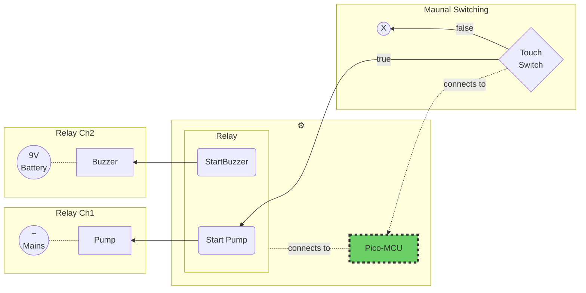
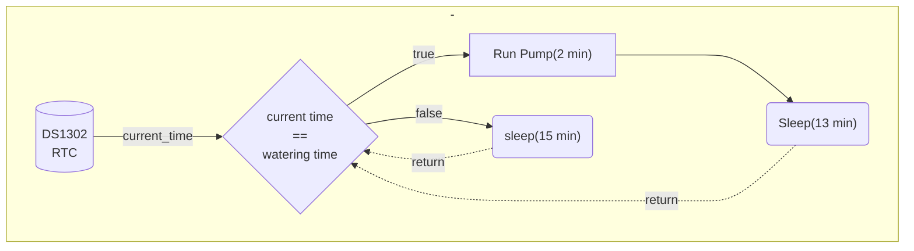

# Raspberry Pi Pico Plant Irrigator

### Microcontroller Used: RaspberryPi-Pico : RP2040

## Peripheral Connections

```mermaid
flowchart RL;
	
	subgraph "Relay Ch1";
		Pump -.- Mains(("~<br>Mains"))
	end
	
	subgraph "Relay Ch2";
		Buzzer -.- Battery(("9V<br>Battery"))
	end
	
	%% Control Module
	subgraph "⚙️"
		subgraph Relay
			direction LR
			SP(Start Pump) --> Pump
			SB("StartBuzzer") --> Buzzer
		end
		Pico-MCU["Pico-MCU"] -."connects to".- Relay
		style Pico-MCU fill:#6acf65,stroke:#333,stroke-width:4px, stroke-dasharray: 5 5
	end
	
	%% Manual Pump Operation using Touch Switch
	subgraph "Maunal Switching"
		TS -. "connects to" .-> Pico-MCU
		TS{"Touch<br>Switch"} --"true"--> SP
		TS--false-->X((X))
		Pico-MCU
	end
```

## Decision Flowchart

```mermaid
flowchart LR
	subgraph "-"
	direction LR
		RTC[("DS1302<br>RTC")] --current_time--> check_time{"current time<br>==<br>watering time"}
		check_time --true--> run_pump
		run_pump["Run Pump(2 min)"] ---> S13("Sleep(13 min)")
		check_time --false--> S15("sleep(15 min)")
		S13 -. return .-> check_time
		S15 -. return .-> check_time
	end
```

